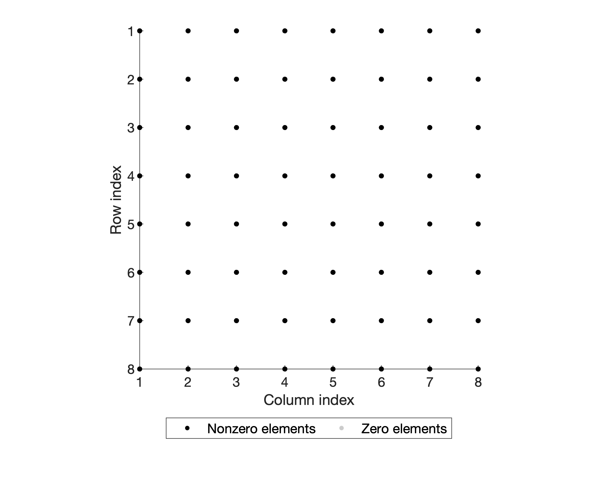
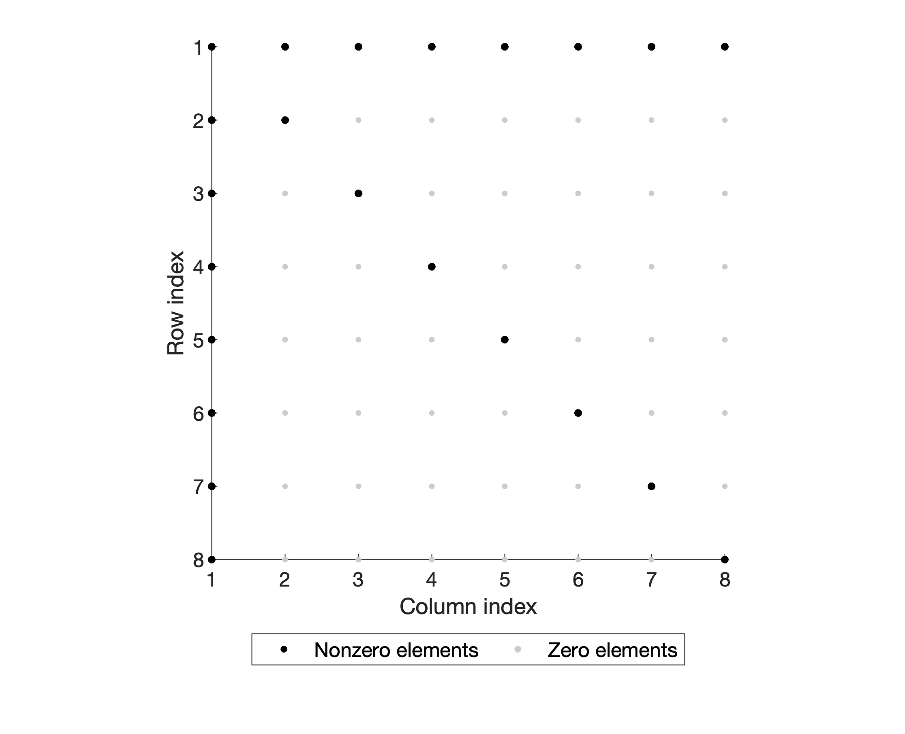
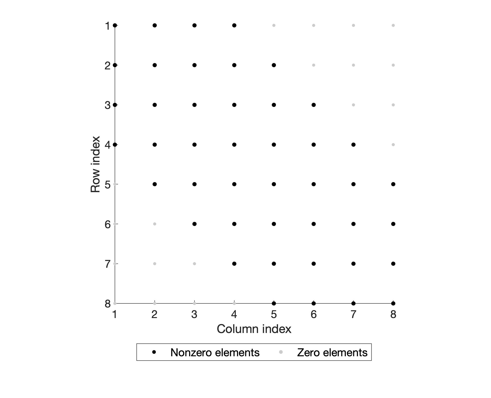

# BD-RIS Sparsity Patterns

This repository constructs and visualizes the sparsity patterns of the susceptance matrix $\mathbf{B}\in\mathbb{R}^{N_I\times N_I}$
for different **Beyond-Diagonal Reconfigurable Intelligent Surfaces (BD-RIS)** architectures.

Each figure shows the position of **nonzero vs zero elements** in the real, symmetric susceptance matrix $\mathbf{B}$.

This repository is based on the graph-theoretic BD-RIS modeling framework proposed in [1]–[3].

Running `main_visualize_bdris_sparsity.m` constructs and visualizes the sparsity patterns of the real symmetric susceptance matrix $\mathbf{B}$ for different BD-RIS architectures.  
The index sets $\mathcal{S}_i$, which specify **which RIS vertices are connected to which other vertices**, are constructed by `arch_sparsity_sets_all` as described in [2,3], and `project_B_to_arch` then constructs $\mathbf{B}$ accordingly.

---

## Fully-Connected RIS

<!--  -->

<!--  -->

   
  <b>Fully-Connected BD-RIS Sparsity Pattern</b>

---

## Group-Connected RIS

<!--  -->

   
  <b>Group-Connected BD-RIS Sparsity Pattern</b>

---

## Single-Connected RIS
<!--  -->

   
  <b>Single-Connected BD-RIS Sparsity Pattern</b>

---

## Tridiagonal RIS
<!--  -->

   
  <b>Tridiagonal-Connected BD-RIS Sparsity Pattern</b>

---

## Arrowhead RIS
<!--  -->

   
  <b>Arrowhead-Connected BD-RIS Sparsity Pattern</b>

---

## Band-Connected RIS (band width q = 3)
<!--  -->

   
  <b>Band-Connected BD-RIS Sparsity Pattern</b>

---

## Stem-Connected RIS (stem width q = 3)
<!--  -->

   
  <b>Stem-Connected BD-RIS Sparsity Pattern</b>

<!-- show them side by side -->
<!---->
<!-- 
 -->
<!--    -->
<!--    -->
<!--    -->
<!-- 
 -->
<!---->
<!-- 
 -->
<!--    -->
<!--    -->
<!-- 
 -->
<!---->
<!-- 
 -->
<!--    -->
<!--    -->
<!-- 
 -->

---

## 📚 References and Further Reading

For more detailed theoretical background on the **graph-theoretic modeling**, **architecture design**, and **optimization of BD-RIS**, please refer to the following key papers:

1. **Beyond Diagonal Reconfigurable Intelligent Surfaces Utilizing Graph Theory: Modeling, Architecture Design, and Optimization**  
   M. Nerini, S. Shen, H. Li, and B. Clerckx,  
   *IEEE Transactions on Wireless Communications*, 2024.  
   🔗 https://ieeexplore.ieee.org/document/10453384  
   💻 MATLAB code: https://github.com/matteonerini/bdris-utilizing-graph-theory  

2. **Beyond-Diagonal RIS in Multiuser MIMO: Graph Theoretic Modeling and Optimal Architectures With Low Complexity**  
   *IEEE Transactions on Information Theory*, 2025.  
   🔗 https://ieeexplore.ieee.org/document/11162566  

3. **Optimization of Beyond Diagonal RIS: A Universal Framework Applicable to Arbitrary Architectures**  
   arXiv preprint, 2024.  
   🔗 https://arxiv.org/abs/2412.15965  

